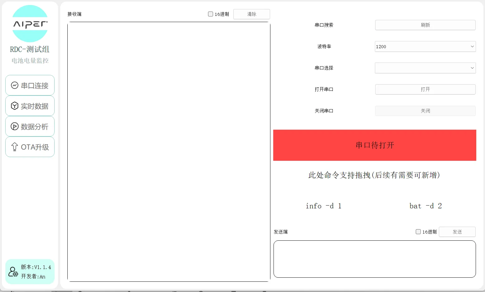

# Pyqt5串口电池监测

#### 介绍
基于Pyqt5的串口调试开发的自动化电池监测工具，使用串口库serial、做图库pyqtgraph，以及接入了任务完成钉钉机器人消息通知。

针对性的主要功能，判断跳电情况以及跳电的时间节点、充放电时长、日志数据解析、动态作图。OTA暂未开放。日志数据显示20S清理屏幕一次，不影响日志存储。

V1.1.4更新内容

1、新增excel筛选

2、优化取值

3、新增16进制发送接收

4、新增根据.json数据作图

5、优化UI界面显示





#### 软件说明
1、基于pyserial二次封装了写入跟读取方法以及16进制数据

2、使用自定义信号的方式进行传值，接入时间戳生成日志文件，日志中每一行的数据精确到了毫秒

3、UI界面为个人开发，使用QListWidght+stackedWidget的方式完成界面切换

4、全文代码对于串口数据，主要针对的修改对象是正则表达式。对于逻辑判断微调即可。

5、1.14版本中新增了log数据解析成excel。这个功能主要针对内部日志数据


#### 安装教程
```
1.  pip install PyQt5
```
```
2.  pip install pyqtgraph
```
```
3.  pip install pyserial
```

如果下载过慢：pip install -i https://pypi.tuna.tsinghua.edu.cn/simple PyQt5，更换镜像即可。

#### 使用说明

1.  运行 - 直接运行run.py文件即可

2.  main.py - 主要是子线程的实例化调用以及一些UI上的简单操作，外加一个回车发送的快捷键以及拖拽操作。

3.  DataChart.py - 做图，主要是DataPlotWidget类，TimeAxisItem类是重写了X轴数据显示，以时间戳时分秒的方式显示

4.  Connect.py - 连接文件，主要是串口连接，以及子线程的运行文件，在这里，动态曲线跟写入，读取数据以及解析日志都在这个文件。

5.  DINGDING.py - 钉钉文件，接入钉钉机器人的，需要修改的地方就是hook_url以及secret。

6.  根目录的.json文件是关键配置文件，在1.14版本后新增了选项。主要是设备信息名称、钉钉电话号码、以及任务结束所发的命令信息。

7.  添加机器人，选择群聊-添加机器人-自定义机器人-添加-机器人名称随意，关键词随意-  **加签(必选，最后复制出来，这也就是secret)** 最后同意，将给的地址复制，也就是hook_url

#### 参与贡献

1.  开发者：清安

2.  微信：qing_an_an

3.  公众号：测个der
