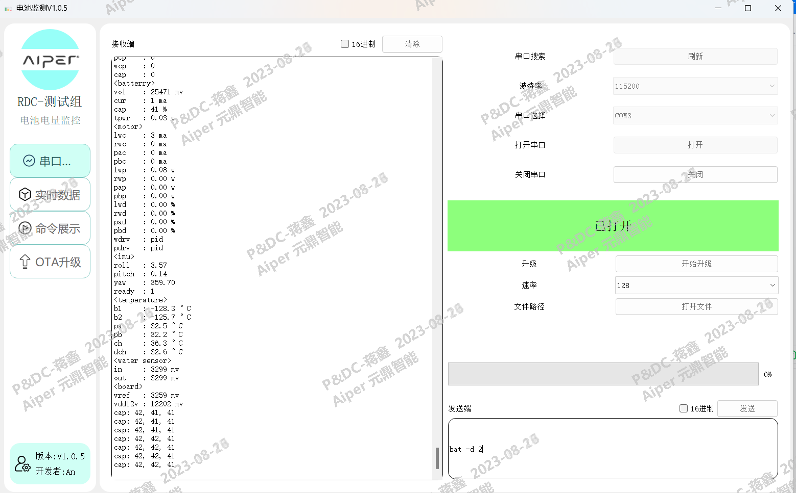

# Pyqt5串口电池监测

#### 介绍
基于Pyqt5的串口调试开发的自动化电池监测工具，使用串口库serial、做图库pyqtgraph，以及接入了任务完成钉钉机器人消息通知。

V1.0.7

1、新增Json配置文件，用于配置钉钉地址、快捷写入指令，减少二次写入

2、优化结束逻辑，兼容其他机型

3、优化日志命名

4、修改生成Json测试数据文件顺序，修改成再钉钉消息发送之前生成

5、支持一键拖入指令(后续可以优化成Json配置文件)

6、新增自动创建"自动化电池监测日志"以及"自动化电池监测数据"文件夹功能，自动将.log以及.json文件分开





#### 软件说明
1、基于serial重新封装了写入跟读取方法

2、使用自定义信号的方式进行传值，接入时间戳生成日志文件，日志中每一行的数据精确到了毫秒

3、UI界面为个人开发，使用QListWidght+stackedWidget的方式完成界面切换


#### 安装教程
```
1.  pip install PyQt5
```
```
2.  pip install pyqtgraph
```
```
3.  pip install pyserial
```

如果下载过慢：pip install -i https://pypi.tuna.tsinghua.edu.cn/simple PyQt5，更换镜像即可。

#### 使用说明

1.  运行 - 直接运行run.py文件即可

2.  main.py - 主要是子线程的实例化调用以及一些UI上的简单操作，外加一个回车发送的快捷键

3.  DataChart.py - 做图，主要是DataPlotWidget类，TimeAxisItem类是重写了X轴数据显示，以时间戳时分秒的方式显示

4.  Connect.py - 连接文件，主要是串口连接，以及子线程的运行文件，在这里，动态曲线跟写入，读取数据都在这个文件。

5.  DINGDING.pu - 钉钉文件，接入钉钉机器人的，需要修改的地方就是hook_url以及secret。

6.  添加机器人，选择群聊-添加机器人-自定义机器人-添加-机器人名称随意，关键词随意-  **加签(必选，最后复制出来，这也就是secret)** 最后同意，将给的地址复制，也就是hook_url

#### 参与贡献

1.  开发者：清安
2.  微信：qing_an_an
