# 自动化电池监测使用教程V1.15版

# 简介

:::
**工具亮点：**

1、实现设备跑机充放电远程监控，做到有**异常情况**或**任务结束**时第一时间通知反馈到测试人员，方便测试人员及时定位以及解决；

2、节约时间成本，解放测试人员对耗时任务的跟踪以及可以与其他**测试任务并行**，提高工作效率；

3、自动生成json格式的数据文件，并提供图表生成。可以为筛选分析提高数据支撑，极大提高数据分析效率。

4、定时执行\结束任务，提供外部接口执行输入指定命令，无需人为盯测。

此工具的升级和优化为测试人员提供了更加灵活、便捷和高效的跑机充放电人为监控解决方案，使测试任务的顺利完成更加可靠和可预测。

**模块自动化与整体用例之间占比20%左右，效率提升90%以上**

**测试过程中的便捷使用程度：**⭐⭐⭐⭐
:::
:::
此工具为解决跑机充放电人为监控问题，适用于“完整循环跑机”，跑机电量、电池电压电流、充电电池电压电流监测。新版本，增加告警提示，PCP-堵转，WIV-内浸水，BCP-过流保护，OCP-电机断路告警

任务完成后，自动计算跑机时长、跳电次数、最大跳电、结束电流电压等。支持@指定负责人，日志名称为自定义项目名称+充放电+日期。例如：6002充电2023\_08\_16\_09\_24\_37.log

任务完成或异常完成，钉钉均有消息提示，并在本地生成两个文件夹，一个用于存放相关数据，另一个生成log日志，钉钉消息通知。图片如下：

:::

# 串口通信界面

:::
刷新后，自动设置115200波特率，无需手动设置，只有一个串口的情况下，可以直接打开串口，无需手动选择。

发送端，支持输入命令后直接回车发送

接收端，默认20S清理一次屏幕数据
:::

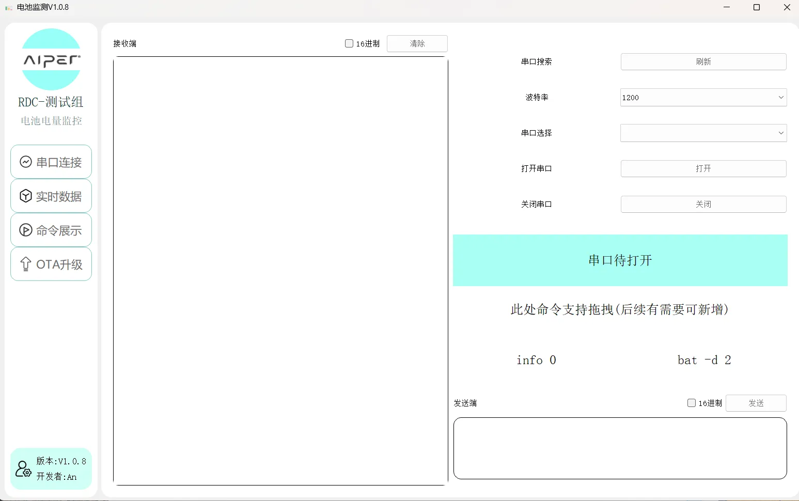

# 参数设置界面

全部参数，避免前后存在空格情况，无需手动加入回车

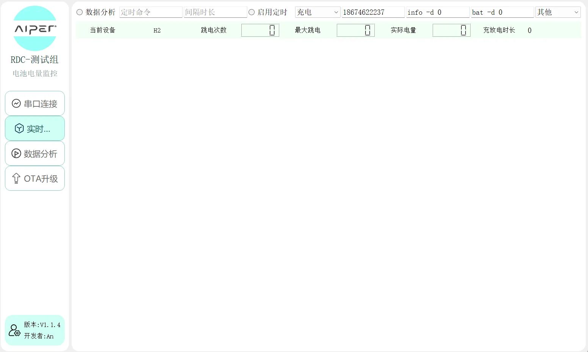

:::
**测试设备**：X3，X5，6002等，避免空格情况

**定时指令**：第三方定时操作，非设备端自带，需配合启用定时以及间隔时长使用

**间隔时长**：单位S，多少S执行一次操作

**启用定时**：选中后才会启用，如果没有效果，需要在通信界面敲回车或者输入相同指定命令来触发

**充电下拉框**：需要根据自己实际情况选择，充电则选择充电，跑机续航则选择放电

**钉钉电话号码**：用于@相关指定人员，例如：@王欣，则需要写入她自己的电话号码

**自定义命令**：info -d 1000这是6系设备自带的info信息日志，1S打印一次，自定义命令可以写入info -d 0意思就是任务完成，停止打印。(bat -d 2这类命令，默认会执行一次bat -d 0)，S1的bat命令需要定时指令完成，且无法检测电量。需要启用info

**清除**：清除图标，此功能鸡肋，后续考虑优化掉

**日志名称**：根据测试设备、充放电+时间戳，命名

**其他**：除S1、H2可选之外，其他系列都选"其他"
:::
:::

此处默认只会检测bat数据并显示。info数据的电量不会显示在这，但是图表中会显示数据图。
:::

## 数据图形显示界面

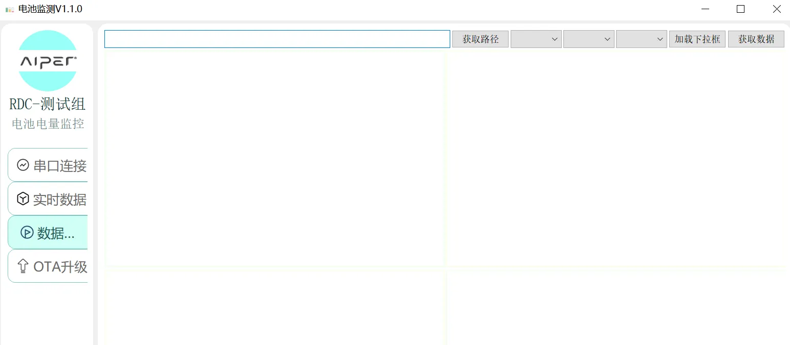

1.  点击进入数据图形显示界面
    
2.  点击 “获取路径” 获取对应需要生成图表的文件
    
    1.  csv文件格式
        

 点击  “加载下拉框”

        选中完自己需要的数据后再点击“获取数据” 

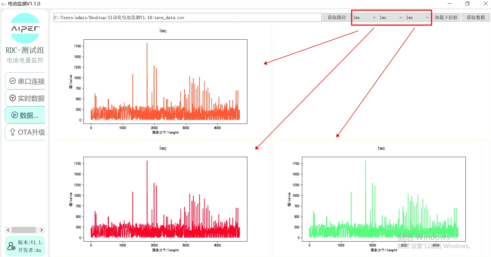

2.  json文件格式 
    
    1.  选中后直接点击“获取数据”
        
    2.  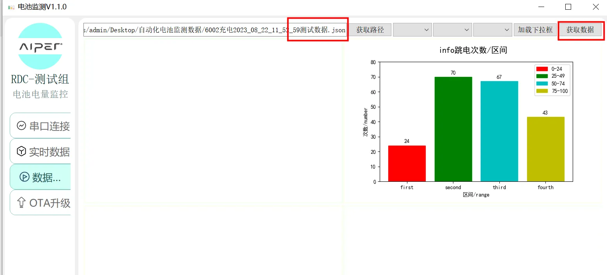
        

# Json文件设置

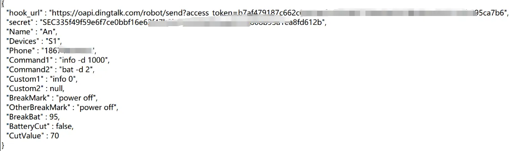

:::
**hook\_url跟secret都是钉钉机器人的配置信息**

**Name：钉钉信息的测试人员名字**

**Devices：是参数设置界面的设备名称**

**Phone：是参数设置界面的负责人钉钉电话号码**

**Command1以及Command2：是串口通信界面的快捷拖入功能命令**

**Custom1以及Custom2：是参数设置界面的结束命令，如果没有则保持null即可，注意不带""**

**BreakMark: 自定义的结束“标志位”**

**OtherBreakMark: 自定义结束标志位 除“+DISCOUNNECT"外 都需要在此多填一遍确认“标志位”**

**Breakbat：是自定义充电电量结束标志位**

**BatteryCut：截断指定电量数据，用于计算时间，如果启动，则修改正true，注意不带""**

**CutValue：截断的具体值，上图70，则是从70-没有电为止，注意不带""**
:::

## 举例-6系

:::
info -d 1000：6系的info数据打印，1s打印一次

bat -d 2：6系的电池数据打印，10毫秒打印一次

 +DISCONNECT:日志中出现"+DISCONNECT"将停止监控

Command1以及Command2修改成这样：那么便捷拖入就会是(**默认是有值的，不写默认都保持null即可。注意不要带""**)：

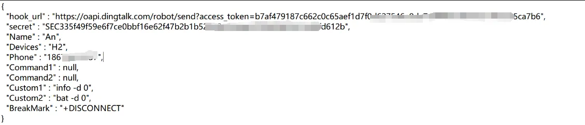

Custom1以及Custom2，此处是停止命令，例如H2，如果设置了info 1000，1s打印一次，条件满足后，那么就会执行info 0。默认有优先执行第一个。

:::

# 充放电设置

:::
充放电需要进行对应的选择才能得到正确的数据结果。

充电：需要选择H2、S1、或者其他

放电：不区分，默认其他，无需选择H2、S1
:::

# 定时操作

:::
此定时任务，用于完成一些其他操作，例如，我想1小时后开始增压模式，或者进入测试模式，定时命令就写test 6，间隔时长就写3600(S为单位计算)，勾选启用定时。开始跑机即可。此定时任务为循环执行。直到关机。
:::

# 1.14 新增自定义截断时间的电量值

1.找到文件夹中的 json文件打开

2.自定义的开始电量为90 ，如果你想要从70开始记录时间 

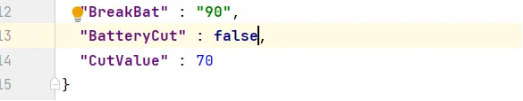

如果你想要自定义开始记录的电量值

BatteryCut：此处将 false 改为 true

CutValue：填写你想要开始记录的电量值

# 1.14 新增一件数据解析

跑机前选中选项，在跑机完成后，会自动解析当前日志文件，生成一个excel文件。数据格式如下：

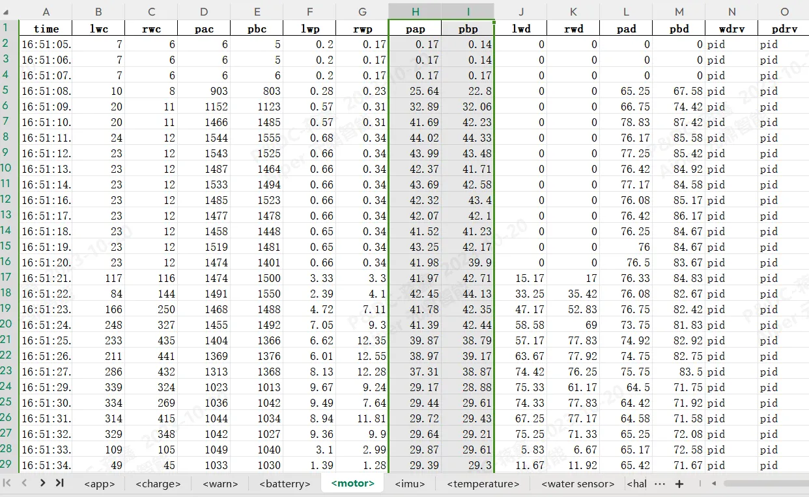

# 设置钉钉机器人

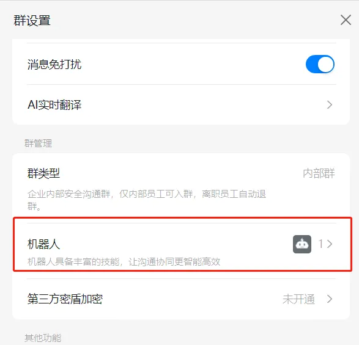

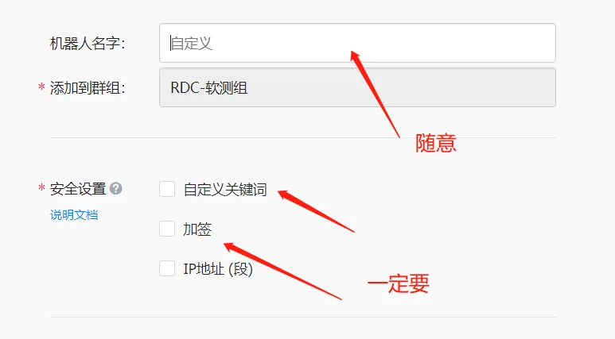

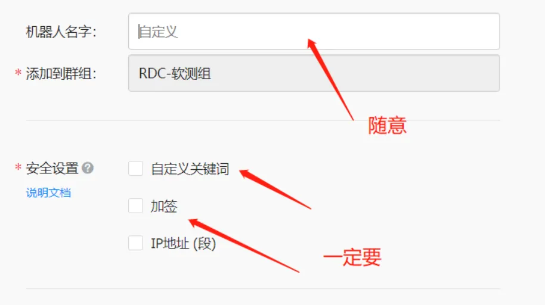

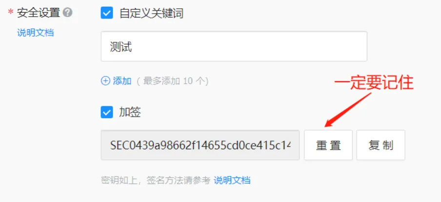

:::
上述的加签地址就是json文件中的：secret

Webhook就是json文件中的：hook\_url
:::
